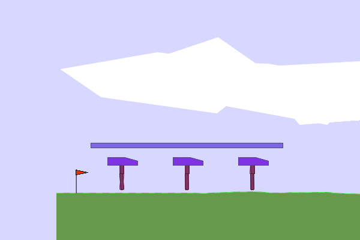
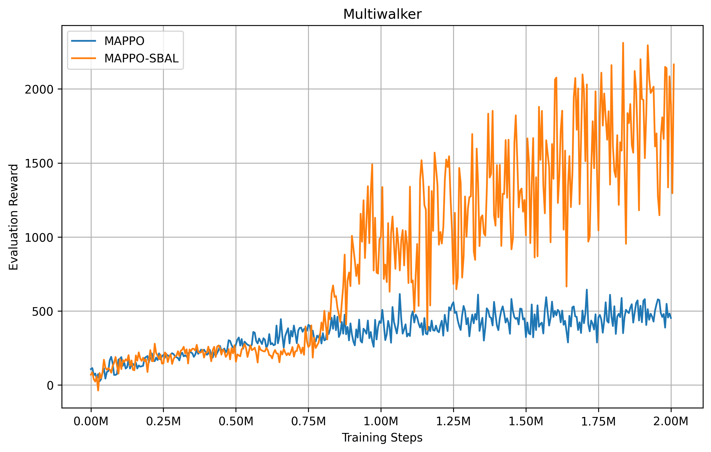

# MARL-code-pytorch
Concise pytorch implements of MARL algorithms, including MAPPO, MADDPG, MATD3, QMIX and VDN.
- Check out the [PIPELINE](https://colab.research.google.com/drive/1Ffmd-AXx6NehiddVK5NIgQOGM5MJE4Qt) to run mappo on MPE.
- Check out the [PIPELINE](https://colab.research.google.com/drive/1f8Aa8KTXwHayQgXitOxrx0ODThNpMpxS) to run mappo on SMAC.
- Check out the [PIPELINE](https://colab.research.google.com/drive/1kBkdh8z7fFi_YG96nyfVYGwwGJMd_65Y) to run mappo on MULTIWALKER (PettingZoo[sisl]).
# Requirements
[Multi-Agent Particle-World Environment(MPE)](https://github.com/openai/multiagent-particle-envs) 
[SMAC-StarCraft Multi-Agent Challenge](https://github.com/oxwhirl/smac) 

# Trainning results
## 1. MAPPO in MPE (discrete action space)

## 2. MAPPO in MULTIWALKER (continuous action space)

   
 
 <em>Left: MAPPO, Right: MAPPO-SBAL</em> 

## 3. MAPPO in  StarCraft II(SMAC)

## 4. QMIX and VDN in StarCraft II(SMAC)

## 5. MADDPG and MATD3 in MPE (continuous action space)

